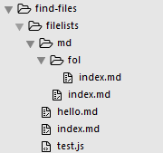

### Install
```js
$ npm install --save find-file
```
### Usage
```js
const Grob = require('find-file');
const mdfiles = Grob.getFiles(["./filelists"],'md',true);
//Then you will get all markdown files
```
### Parameters
(1)source

The first paramter is source folder to search  file with special suffix. It can be an array or an object. When it is an object ,we will only care about value of object while key is omitted!

(2)suffix

To search file with this suffix, such as `"md" or "js/jsx"` and so on.

(3)isObject

When this one is set true, then we will get something like bellow with file structure of this:



```js
{ filelists:
   { hello: 'filelists/hello.md',
     index: 'filelists/index.md',
     md:
      { fol: { 
        index: 'filelists/md/fol/index.md'
         },
        index: 'filelists/md/index.md' 
     }
 }
}
```
 When this paramter is false, we will get something like that:
```js
[ 'filelists/hello.md',
  'filelists/index.md',
  'filelists/md/fol/index.md',
  'filelists/md/index.md',
]
```

### API

(1)getFiles

Get files with special suffix

(2)traverse

Get filename with path prefixed , it is a inverse operation of getFiles.
```js
Grob.traverse(files,function(filename){
  if(!filename)
  console.log(filename);
 //  filelists/hello.md
  // filelists/index.md
  // filelists/md/fol/index.md
  // filelists/md/index.md
})
```


